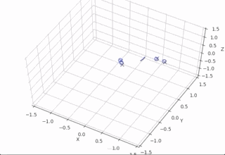
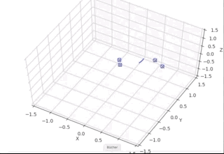
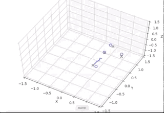
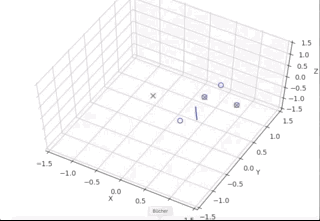
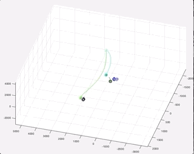
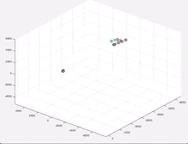

# Multiple Object Tracking with Point Patterns

## This work was done as my Bachelor Project.
 
## This repository is still a work in progress and desperately needs a clean-up.

Code regarding the Kalman Filter approach is spread throughout most folders. The main file is **ownMOT.mat** and all relevant functions are used there.
The Code regarding the deep learning approach can be found in the **ModernMethods** folder.

## Results

### SOT in a noise free setting
See the neural network results on the left and the Kalman Filter results on the right
  

### SOT in a noisy setting
  

### MOT results
  

